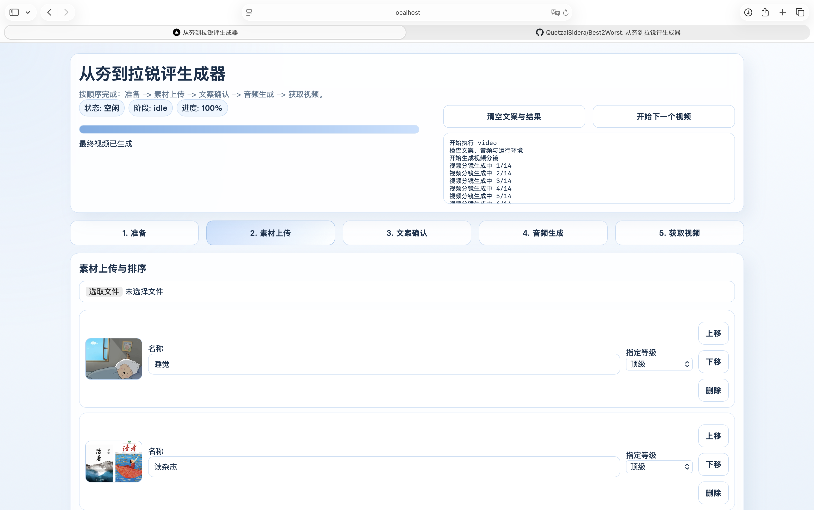

# 从夯到拉锐评生成器

把素材丢进来，把锐评视频拿出去。

这是一个从素材图直接生成“从夯到拉”短视频的 Web App：

- 自动生成锐评文案
- 自动生成配音
- 自动合成分镜和成片
- 支持图形化修改名称、评级、文案和语音类型

## 示例

界面示例：




## 快速开始

### 1. 准备 `config.toml`

复制 `config.example.toml` 为 `config.toml`，然后填写两个 API Key：

```toml
[text_api]
api_key = "你的 DeepSeek API Key"

[tts_api]
api_key = "你的硅基流动 API Key"
```

### 2. 启动

确保本机已安装 Docker 和 Docker Compose：

```bash
docker compose up --build
```

启动完成后访问：

```text
http://localhost:3000
```

## 使用流程

页面分成 5 步：

### 1. 准备

- 配置 DeepSeek 文案模型
- 配置硅基流动配音模型
- 选择语音类型
- 调整配音速度
- 编辑提示正文

语音类型支持：

- `硅基流动-*`：系统预置音色
- `内置-*`：项目内置参考音色
- `自定义-*`：上传自己的参考音频

### 2. 素材上传

- 上传图片
- 修改显示名称
- 调整顺序
- 可选指定评级

### 3. 文案确认

- 生成锐评文案
- 图形化修改每个项目的评级和台词
- 支持按项目增删句子

### 4. 音频生成

- 生成完整配音
- 在浏览器中直接试听

### 5. 获取视频

- 生成最终视频
- 在浏览器中直接预览成片

## 当前架构

### 前端

Next.js 多页面结构：

- `/setup`
- `/materials`
- `/copywriting`
- `/audio`
- `/video`

前端通过 `/backend/*` 代理访问 Flask API，不再依赖服务端模板页面来维持状态。

### 后端

Flask 暴露 JSON API，负责：

- 保存准备配置
- 上传素材
- 保存文案
- 启动文案 / 音频 / 视频任务
- 返回任务状态
- 返回最终音频和视频

### 数据

所有业务数据都放在 SQLite：

- 素材
- 自定义音色
- 文案
- 音频
- 视频
- 业务配置

`config.toml` 只保留 API Key。

## Docker 说明

`docker-compose.yml` 现在包含两个服务：

- `frontend`：Next.js，面向用户，暴露 `3000`
- `backend`：Flask，内部服务，容器内监听 `8001`

浏览器只访问一个入口：

```text
http://localhost:3000
```

数据库卷：

- `best2worst_db -> /app/data`

本地配置文件挂载：

- `./config.toml -> /app/config.toml`

## 本地开发

### 启动后端

```bash
pip install -r requirements.txt
python3 webapp.py
```

后端默认监听：

```text
http://localhost:8001
```

### 启动前端

```bash
cd frontend
npm install
BACKEND_ORIGIN=http://localhost:8001 npm run dev
```

前端默认监听：

```text
http://localhost:3000
```

## 清理与重置

界面顶部支持两个动作：

- `清空文案与结果`
- `开始下一个视频`

其中：

- `清空文案与结果`：保留素材，只清空文案、音频、视频
- `开始下一个视频`：清空素材、文案、音频、视频，但保留准备配置

## 一句话介绍

**从夯到拉锐评生成器：从素材到成片，一条流水线自动打完。**
